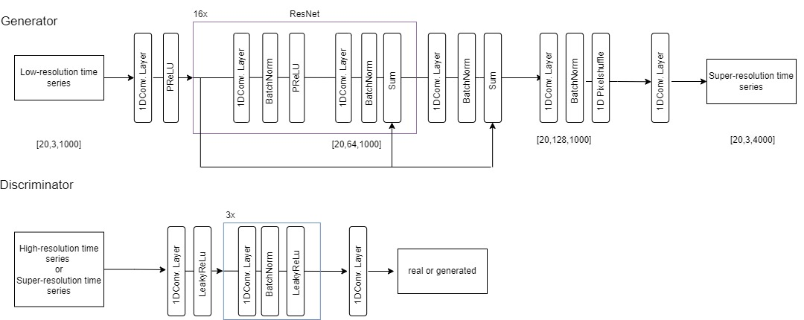
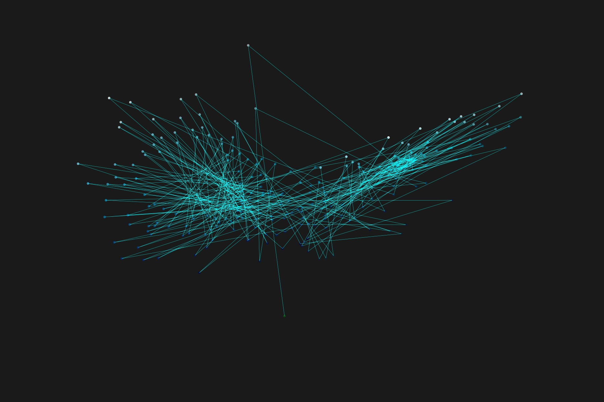
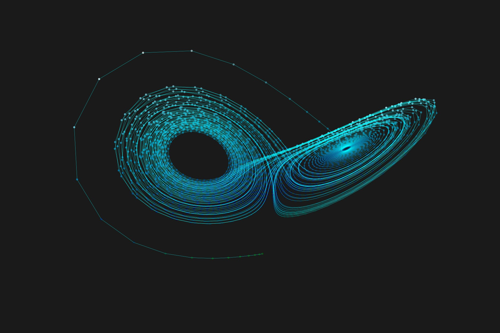
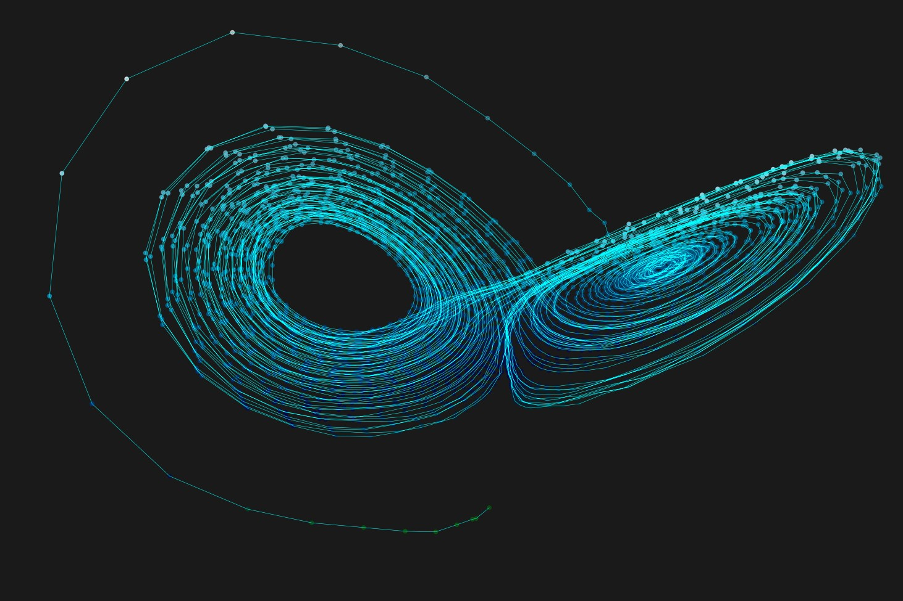
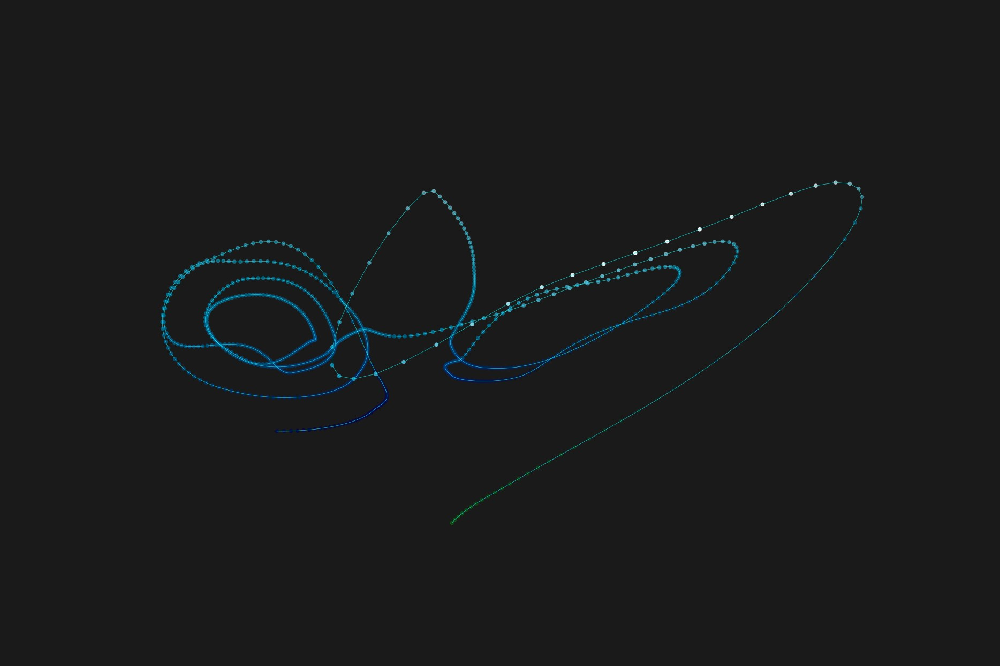
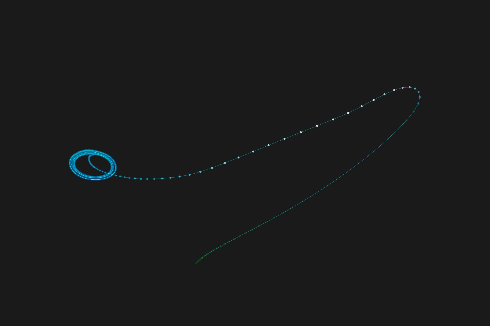
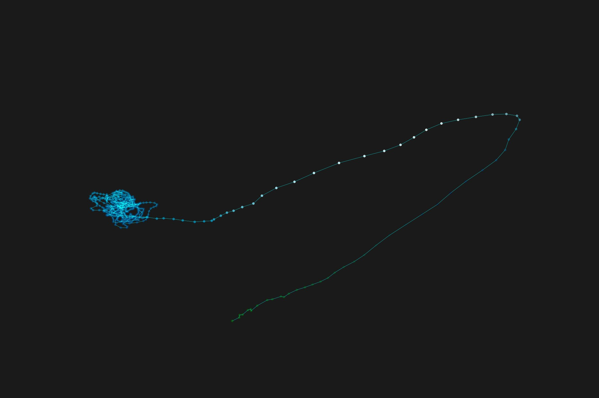

#README

# TS_SRGAN (Time-Series Super-Resolution GAN)
TS_SRGAN is a Python-based project implementing a Generative Adversarial Network (GAN) 
designed for enhancing the resolution of time-series data. 
Inspired by the original SRGAN architecture from the  paper [Photo-Realistic Single Image Super-Resolution Using a Generative Adversarial Network](https://arxiv.org/pdf/1609.04802), this project aims to model and generate 
high-resolution data from low-resolution inputs, 
applicable across various domains such as financial data, environmental sensor data, 
and medical signal processing.

Several experiments were conducted to test the abilities of TS_SRGAN. The first one is
more similar to the application of the original SRGAN, which is adding pixels to images to
increase the resolution. By training the TS_SRGAN network to generate a trajectory with
an increased amount of time points, it was possible the enhance the temporal resolution
and the smoothness of the trajectories significantly.
The other approach for the experiments was the generating of training data with
varying accuracy. This is done by adjusting the error tolerance for the low-resolution and
high-resolution trajectories and keeping the amount of time points fixed. Because of the
nature of GAN, the Generator was trained to enhance the lower-resolution trajectory by
reconstructing their high-resolution counterparts and therefore deceive the Discriminator
with its output. This experiment showed that the network was able to improve the trajectories until a
specific point.

## Model Architecture

## Features

- **Data Enhancement**: Improve the accuracy of 1D time-series data.
- **Customizable Model Architecture**: Flexible GAN structure suitable for various types of time-series data.
- **Visualization Tools**: Built-in plotting functions for visualization of results.

## Modules Description

- **data.py**: Generates and preprocess data (from the Lorenz attractor)
- **model.py**: Contains the definitions of the Generator and Discriminator networks
- **loss.py**: Defines the loss functions used in training the GAN
- **training.py**: Manages the training loops, including backpropagation and optimization
- **plot.py**: Provides functions for visualizing both input and output data, as well as training progress.

## Experiments 

## Experiment Results

### Experiment 1: Enhance the temporal resolution of a low-resolution trajectory

### Experiment 1: 

<table>
  <tr>
    <th>Low Resolution</th>
    <th>High Resolution</th>
    <th>Super Resolution</th>
  </tr>
  <tr>
    <td></td>
    <td></td>
    <td></td>
  </tr>
</table>

### Experiment 5: Enhancing the accuray of a low-resolution trajectory

<table>
  <tr>
    <th>Low Resolution</th>
    <th>High Resolution</th>
    <th>Super Resolution</th>
  </tr>
  <tr>
    <td></td>
    <td></td>
    <td></td>
  </tr>
</table>

